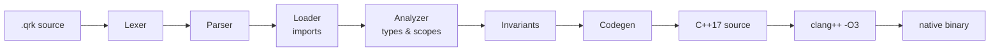

# Quark

Quark is a small, dynamically-typed programming language that compiles to native
binaries. You write code that reads like a scripting language; the Quark compiler
translates it to C++17, hands it to `clang++`, and produces a fast standalone
executable.

This README is a hands-on onboarding guide: install the compiler, run your first
program, and learn the language feature by feature with examples you can paste and
run. Every code sample here was run against the current compiler.

> **Maturity note.** Quark is an early, actively-developed project. The core
> language (functions, closures, control flow, pattern matching, lists, dicts,
> vectors, and structs) works today. Some advertised features are still in
> progress — most notably `table` literals, which are specified but **do not yet
> parse**. See [Current status and roadmap](#current-status-and-roadmap) for an
> honest, verified breakdown.

## Table of contents

- [Quickstart](#quickstart)
- [How a Quark program is built](#how-a-quark-program-is-built)
- [Language tour](#language-tour)
  - [Comments](#comments)
  - [Values and variables](#values-and-variables)
  - [Printing and input](#printing-and-input)
  - [Operators and precedence](#operators-and-precedence)
  - [Strings](#strings)
  - [Booleans and truthiness](#booleans-and-truthiness)
  - [Conditionals and the ternary](#conditionals-and-the-ternary)
  - [Pattern matching with `when`](#pattern-matching-with-when)
  - [Loops](#loops)
  - [Functions](#functions)
  - [Lambdas and closures](#lambdas-and-closures)
  - [Pipes](#pipes)
  - [Results: `ok` and `err`](#results-ok-and-err)
  - [Lists](#lists)
  - [Dicts](#dicts)
  - [Vectors](#vectors)
  - [Structs](#structs)
  - [Modules and imports](#modules-and-imports)
- [Standard library reference](#standard-library-reference)
- [Command-line reference](#command-line-reference)
- [Project layout](#project-layout)
- [Current status and roadmap](#current-status-and-roadmap)
- [Troubleshooting](#troubleshooting)
- [Further reading](#further-reading)
- [License](#license)

## Quickstart

### 1. Prerequisites

You need three tools on your `PATH`:

| Tool | Why | Check |
|---|---|---|
| Go 1.21+ | builds the compiler | `go version` |
| `clang++` (C++17) | compiles generated C++ — **`g++` is not supported** | `clang++ --version` |
| CMake | builds the vendored garbage collector on first run | `cmake --version` |

Quark vendors the Boehm garbage collector under `deps/bdwgc`. The very first
`build`/`run` bootstraps it with CMake automatically; this happens once.

### 2. Build the compiler

The compiler lives in `src/core/quark`. Build it there so it can find its runtime
headers and standard library (both are resolved relative to the binary):

```bash
cd src/core/quark
go build -o quark .
```

You now have a `quark` executable in `src/core/quark`.

> Keep the binary in `src/core/quark`. It locates the C++ runtime headers at
> `./runtime/include` next to itself and the standard library at `../stdlib`. If
> you move it, see [Troubleshooting](#troubleshooting).

### 3. Write and run "Hello, Quark!"

Create a file `hello.qrk`:

```quark
println('Hello, Quark!')
```

Compile and run it:

```bash
./quark run hello.qrk
```

```text
Hello, Quark!
```

`quark run` compiles to a temporary native binary and executes it. The first run
also bootstraps the GC (a one-time CMake step), so expect it to take a little
longer; subsequent runs are fast.

To run one of the bundled example programs:

```bash
./quark run ../../testfiles/smoke_syntax.qrk
```

The bare form `./quark hello.qrk` is shorthand for `./quark run hello.qrk`.

## How a Quark program is built

Quark is a compiler, not an interpreter. A `.qrk` file flows through seven Go
stages, is emitted as a single C++17 translation unit, and is compiled by
`clang++` into a native executable:



Two consequences worth knowing as a beginner:

- **Errors are reported early and loudly.** The lexer, parser, and analyzer catch
  many mistakes before any C++ is generated. Diagnostics carry stable codes such
  as `QK-PARSE-001` (syntax) and `QK-CHECK-001` (semantics/types).
- **You need a working `clang++` toolchain**, because the final step is real C++
  compilation. Generated code is built with `-O3`.

You can inspect any stage with the CLI — `quark lex`, `quark parse`, `quark check`,
and `quark emit` (see [Command-line reference](#command-line-reference)).

## Language tour

The examples below are self-contained. Put any snippet in a `.qrk` file and run it
with `quark run`.

### Comments

Only line comments exist:

```quark
// This is a comment.
x = 1   // trailing comments are fine too
```

### Values and variables

Quark is dynamically typed. Assign with `=`; no declaration keyword is needed:

```quark
count = 3
name  = 'Ada'
pi    = 3.14159
ok_flag = true
nothing = null
```

The built-in value types are integers, floats, strings, booleans, `null`, lists,
dicts, vectors, results, structs, and functions.

Type annotations are **optional** and serve as compile-time checks; all runtime
values are dynamic. A typed declaration uses `name: Type = expr`:

```quark
age: int = 36
label: str = 'hello'
```

If the right-hand side does not match the annotation, you get a compile-time
error. The available annotation names are `int`, `float`, `str`, `bool`, `any`,
`result`, `list`, `dict`, `vector`, and any `struct` type you define. Generic
forms like `list[int]` are **not** supported.

### Printing and input

```quark
println('hello')              // value followed by a newline
print('no newline by default?') // print also writes a trailing newline by default
name = input('Your name: ')   // read a line from stdin (prompt is optional)
```

- `println(value)` writes `value` followed by a newline.
- `print(value, end, width, align, pad)` writes `value` with up to four optional
  formatting arguments (custom line terminator, minimum field width, alignment,
  and pad character).
- `input()` / `input(prompt)` reads a line of text and returns a string.

> **Heads up:** printing a list, vector, or dict shows a compact summary, not the
> elements:
>
> ```quark
> println(list [1, 2, 3])   // [list len=3]
> println(vector [1, 2, 3]) // [vector len=3]
> ```
>
> To see the contents, join them into a string or use the `std/fmt` module:
>
> ```quark
> println(list [1, 2, 3].join(', '))   // 1, 2, 3
> ```

### Operators and precedence

Arithmetic: `+ - * / % **` (where `**` is exponentiation and is right-associative).
Comparison: `< <= > >= == !=`. Logical: `and`, `or`, `!`. Dataflow: `|` (pipe).

From lowest to highest binding:

| Level | Operators |
|---|---|
| 1 (lowest) | `=` (assignment) |
| 2 | `\|` (pipe) |
| 3 | `a if cond else b` (ternary) |
| 4 | `or` |
| 5 | `and` |
| 6 | `== !=` |
| 7 | `< <= > >=` |
| 8 | `+ -` |
| 9 | `* / %` |
| 10 | `**` (right-associative) |
| 11 | unary `! -` |
| 12 (highest) | postfix `.` `[]` `()` |

```quark
println(1 + 2 * 3)      // 7
println(2 ** 3 ** 2)    // 512  (right-associative: 2 ** (3 ** 2))
println(-5)             // -5
println(!false)         // true
```

### Strings

String literals use single or double quotes. Supported escapes are `\\`, `\'`,
`\"`, `\n`, `\t`, `\r`, and `\0`. (String interpolation is planned but not yet
available.)

Strings carry methods, called with dot syntax, and they chain:

```quark
println('  Quark  '.trim().upper())   // QUARK
println('hello world'.split(' ').join('-'))  // hello-world
println('abcdef'.slice(1, 4))         // bcd
println('hello'.contains('ell'))      // true
```

See the [string methods table](#string-methods-str) for the full set.

### Booleans and truthiness

Conditions accept any type and are coerced via truthiness — you do not need to
convert to `bool` explicitly:

```quark
if 'non-empty':       // truthy
    println('yes')

if 0:                 // falsy
    println('never')
```

`and` / `or` short-circuit and return one of their operands (Python-style), while
unary `!` always returns a `bool`. Use `to_bool(x)` for an explicit conversion.

### Conditionals and the ternary

`if` / `elseif` / `else` use indentation blocks introduced by `:`:

```quark
fn classify(n) ->
    if n < 0:
        'negative'
    elseif n == 0:
        'zero'
    else:
        'positive'

println(classify(10))   // positive
```

The ternary is an expression:

```quark
x = 7
label = 'big' if x > 5 else 'small'
println(label)          // big
```

### Pattern matching with `when`

`when` matches a value against patterns in order. Patterns may be literals,
or-patterns with `or`, the wildcard `_`, or result patterns (`ok x` / `err e`):

```quark
fn describe(n) ->
    when n:
        0 -> 'zero'
        1 or 2 or 3 -> 'small'
        _ -> 'many'

println(describe(2))    // small
```

### Loops

`for` iterates over a `list`, `vector`, or `str`. `range` produces a list of
integers — `range(end)`, `range(start, end)`, or `range(start, end, step)`:

```quark
total = 0
for i in range(1, 6):   // 1, 2, 3, 4, 5
    total = total + i
println(total)          // 15
```

`while` repeats while its condition is truthy. `break` and `continue` work inside
either loop (using them outside a loop is a compile-time error):

```quark
count = 3
while count > 0:
    println(count)
    count = count - 1
```

### Functions

Define a named function with `fn`. Parentheses around parameters are always
required. The body may be a single expression after `->`:

```quark
fn add(x, y) -> x + y
println(add(2, 3))      // 5
```

…or an indented block (the last expression is the result):

```quark
fn abs_diff(a, b) ->
    if a > b:
        a - b
    else:
        b - a

println(abs_diff(3, 8)) // 5
```

**Return type annotations** go between the `)` and the `->`. They are checked at
compile time:

```quark
fn greet(name: str) str -> 'Hello, '.concat(name)
```

**Default parameters** use `= literal`. Only literal defaults are allowed for
functions (numbers, strings, booleans, `null`, a negated number, or an empty
list), and required parameters must come before defaulted ones:

```quark
fn add_n(x, n = 1) -> x + n
println(add_n(5))       // 6
println(add_n(5, 10))   // 15
```

### Lambdas and closures

A lambda is `fn(params) -> expression`. Assign it to a variable to name it:

```quark
inc = fn(x) -> x + 1
println(inc(41))        // 42
```

Lambdas capture variables from the enclosing scope (this is what makes them
closures):

```quark
base = 100
bump = fn(x) -> x + base   // captures `base`
println(bump(5))           // 105
```

You can build higher-order functions, but note a current parser limitation: you
cannot write a lambda *inline* immediately after `->`. Assign it to a variable
first, then return that variable:

```quark
fn make_adder(n) ->
    f = fn(x) -> x + n     // OK: lambda on the right-hand side of `=`
    f                       // return the closure

add5 = make_adder(5)
println(add5(10))          // 15

// fn make_adder(n) -> fn(x) -> x + n   // does NOT parse yet
```

### Pipes

The pipe operator `|` feeds the left value in as the first argument of the call on
the right. It makes left-to-right data transformations read naturally:

```quark
'hello'.upper() | println()        // HELLO

inc = fn(x) -> x + 1
5 | inc() | println()              // 6
```

Pipes cooperate with default parameters — `5 | add_n()` fills `n` with its
default.

### Results: `ok` and `err`

Quark models recoverable failure with explicit result values rather than
exceptions. Construct them with `ok expr` and `err expr`, and unpack them with
`when`:

```quark
fn safe_div(a, b) ->
    if b == 0:
        err 'division by zero'
    else:
        ok (a / b)

when safe_div(10, 2):
    ok value -> println(value)     // 5
    err msg  -> println(msg)

when safe_div(10, 0):
    ok value -> println(value)
    err msg  -> println(msg)       // division by zero
```

Helper builtins: `is_ok(r)`, `is_err(r)`, and `unwrap(r)` (which aborts loudly if
`r` is an `err`). Richer combinators like `unwrap_or` and `map_ok` are planned but
not yet available.

### Lists

Lists are general-purpose, ordered, growable collections. The `list` keyword is
required in the literal:

```quark
nums = list [3, 1, 2]
nums.push(4)                 // append (mutates in place)
println(len(nums))           // 4
println(nums.get(0))         // 3
println(nums.reverse().join('-'))  // 4-2-1-3
```

Index with `[]` (negative indices count from the end); assign to an index to
replace an element:

```quark
xs = list [10, 20, 30]
println(xs[-1])              // 30
xs[0] = 99
println(xs[0])               // 99
```

See the [list methods table](#list-methods-list) for the full set.

### Dicts

Dicts map identifier keys to values. The `dict` keyword is required, and keys in a
literal are written as bare identifiers:

```quark
user = dict { name: 'ada', age: 36 }

println(user.name)           // ada — dot read
user.age = 37                // dot write
println(user.age)            // 37

user = user.set('city', 'london')   // .set returns the updated dict
println(user.city)           // london
println(user.get('missing')) // null — missing keys read as null
```

Dicts support `.get`, `.set`, `.keys`, `.values`, and `.items`. Bracket indexing
(`user['name']`) is **not** supported — use dot access or `.get` / `.set`.

### Vectors

Vectors are typed, columnar, data-oriented arrays. Unlike lists, arithmetic and
comparisons apply element-wise across the whole vector, which is convenient for
numeric work:

```quark
v = vector [1, 2, 3, 4]
println(type(v))             // vector[i64]

w = v + 10                   // element-wise add -> vector [11, 12, 13, 14]
println(sum(w))              // 50

mask = v > 2                 // element-wise compare -> bool vector
println(sum(mask))           // 2   (true counts as 1)
```

Vectors support `.get`, `.fillna` (replace nulls), `.astype` (cast dtype), and
`.to_list`. Convert a list with `.to_vector()`. You can also index a vector with a
boolean mask vector to filter it: `v[v > 2]`.

### Structs

Structs are fixed-shape records with named, typed fields — the right tool when a
`dict` is too loose. Declare one with `struct`:

```quark
struct Customer:
    id: int
    name: str
    age: int = 0      // optional field with a default
    city: str
```

Construct with named fields. Missing required fields, unknown fields, duplicate
fields, and type mismatches are all compile-time errors. Both inline and
multi-line literals are allowed:

```quark
c = Customer { id: 1, name: 'Alice', city: 'NYC' }
println(c.age)        // 0   (used the default)
println(type(c))      // Customer

c3 = Customer {
    id: 3
    name: 'Charlie'
    age: 25
    city: 'SF'
}
```

Field defaults may be constant expressions:

```quark
struct Config:
    timeout: int = 60 * 60   // 3600
    retries: int = 3
```

Struct values are **immutable**: there is no `c.field = ...` assignment. To
"update" a struct, reconstruct it (this is the canonical pattern in v0.1):

```quark
older = Customer { id: c.id, name: c.name, age: c.age + 1, city: c.city }
println(older.age)    // 1
```

Structs may be passed to and returned from functions and stored in lists. In v0.1
there are no methods, `impl` blocks, inheritance, or whole-struct `==` (compare
fields explicitly).

### Modules and imports

A module groups functions under a name. Import it with `use`, and the recommended
form binds an alias you then qualify calls with.

**Same-file module:**

```quark
module mathx:
    fn square(x) -> x * x
    fn cube(x) -> x * x * x

use mathx as m
println(m.square(9))   // 81
println(m.cube(3))     // 27
```

**File import** (relative or absolute path, no extension):

```quark
use './lib/helpers' as h
println(h.format_name('Ada'))
```

**Standard library import** (the `std/` prefix; see
[stdlib modules](#standard-library-modules)):

```quark
use 'std/io' as io
use 'std/fmt' as fmt

println(io.exists('hello.qrk'))         // true / false
println(fmt.show_list(list [3, 1, 2]))  // formatted, readable list
```

> **Prefer the `as alias` form.** Importing without an alias injects the module's
> names into the current scope, which can collide with your own definitions and
> produce `QK-CHECK-001` symbol-conflict errors. Aliased imports keep names tidy
> and unambiguous.

## Standard library reference

All free functions and methods below are globally available — **no import is
required** for them. (The `std/io` and `std/fmt` modules are separate; see
[Standard library modules](#standard-library-modules).)

### Free functions

| Function | Arity | Returns | Notes |
|---|---:|---|---|
| `print` | 1–5 | — | value plus optional end, width, align, pad |
| `println` | 1 | — | value followed by a newline |
| `input` | 0–1 | str | optional string prompt |
| `len` | 1 | int | length of str / list / dict / vector |
| `to_str` | 1 | str | convert to string |
| `to_int` | 1 | int | parse/convert; runtime error if invalid |
| `to_float` | 1 | float | parse/convert; runtime error if invalid |
| `to_bool` | 1 | bool | truthiness conversion |
| `type` | 1 | str | runtime type name (e.g. `vector[i64]`, `Customer`) |
| `is_ok` | 1 | bool | true if a result is `ok` |
| `is_err` | 1 | bool | true if a result is `err` |
| `unwrap` | 1 | any | value of an `ok`; aborts on `err` |
| `range` | 1–3 | list | `range(end)`, `range(start, end)`, `range(start, end, step)` |
| `abs` | 1 | any | absolute value (preserves int/float) |
| `min` | 1–2 | any | the smaller of two scalars, or the minimum of a single numeric vector |
| `max` | 1–2 | any | the larger of two scalars, or the maximum of a single numeric vector |
| `sum` | 1 | any | sum of a numeric or bool vector (not a list) |
| `sqrt` | 1 | float | error on negative input |
| `floor` | 1 | int | round toward −∞ |
| `ceil` | 1 | int | round toward +∞ |
| `round` | 1 | int | round to nearest int |
| `enumerate` | 1 | list | list of `{ index, value }` records |

### Methods by receiver type

#### String methods (`str`)

| Method | Description |
|---|---|
| `.upper()` | uppercase copy |
| `.lower()` | lowercase copy |
| `.trim()` | strip leading/trailing whitespace |
| `.contains(sub)` | substring test |
| `.startswith(prefix)` | prefix test |
| `.endswith(suffix)` | suffix test |
| `.replace(old, new)` | replace all occurrences |
| `.concat(other)` | concatenate two strings |
| `.split(sep)` | split into a list of strings |
| `.slice(start, end)` | substring `[start, end)` |

#### List methods (`list`)

| Method | Description |
|---|---|
| `.push(item)` | append (mutates); returns the list |
| `.pop()` | remove and return the last item |
| `.get(idx)` | item at index, or `null` if out of bounds |
| `.set(idx, val)` | set the item at index |
| `.insert(idx, val)` | insert at index |
| `.remove(idx)` | remove and return the item at index |
| `.slice(start, end)` | sublist `[start, end)` |
| `.reverse()` | reverse in place |
| `.concat(other)` | concatenate two lists |
| `.join(sep)` | join into a string |
| `.enumerate()` | list of `{ index, value }` records |
| `.to_vector()` | convert to a typed vector |

#### Dict methods (`dict`)

| Method | Description |
|---|---|
| `.get(key)` | value for key, or `null` if missing |
| `.set(key, val)` | returns the updated dict |
| `.keys()` | list of keys |
| `.values()` | list of values |
| `.items()` | list of `{ key, value }` records |

#### Vector methods (`vector`)

| Method | Description |
|---|---|
| `.get(idx)` | scalar value at index |
| `.fillna(val)` | replace null entries |
| `.astype(dtype)` | cast to a different dtype |
| `.to_list()` | convert back to a list |

### Standard library modules

These ship under `src/core/stdlib` and are imported with the `std/` prefix:

| Module | Import | Highlights |
|---|---|---|
| `io` | `use 'std/io' as io` | `io.open`, `io.read`, `io.write`, `io.close`, `io.seek`, `io.exists`, and `io.seek_set` / `io.seek_cur` / `io.seek_end` |
| `fmt` | `use 'std/fmt' as fmt` | `fmt.show_list`, `fmt.show_vec`, `fmt.show_dict`, `fmt.table`, `fmt.head`, `fmt.tail` for readable rendering |

For deeper behavior notes, see [stdlib.md](stdlib.md). The code-level source of
truth for builtin names and arities is
`src/core/quark/builtins/catalog.go`.

## Command-line reference

```text
quark <command> [arguments]
```

| Command | Purpose |
|---|---|
| `quark lex <file>` | tokenize and print the token stream |
| `quark parse <file>` | parse and print the AST |
| `quark check <file>` | run the analyzer (types, scopes); report diagnostics only |
| `quark emit <file>` | print the generated C++ to stdout |
| `quark build <file> [-o out] [--lto]` | compile to a native executable |
| `quark run <file> [--debug] [--lto]` | compile and run |
| `quark <file>` | shorthand for `quark run <file>` |
| `quark help` | show usage |

Flags:

| Flag | Applies to | Effect |
|---|---|---|
| `-o <name>` | `build` | output executable name |
| `--debug`, `-d` | `run` | keep the generated `.cpp` next to the source and print the compile command |
| `--lto` | `build`, `run` | enable link-time optimization |

Diagnostics behavior:

- Parser, loader, and analyzer messages print with stable codes (`QK-PARSE-001`,
  `QK-CHECK-001`, …).
- Analyzer **warnings** are shown but do not fail the command.
- Analyzer **errors** fail the command with a non-zero exit code.
- Internal invariant failures (`INV-*`) are treated as compiler bugs and fail
  loudly.

Examples:

```bash
quark run hello.qrk            # compile and run
quark build hello.qrk -o hello # produce ./hello
quark emit hello.qrk           # see the generated C++
quark check hello.qrk          # type-check only
```

## Project layout

| Path | Contents |
|---|---|
| `src/core/quark` | the Go compiler; build the `quark` binary here |
| `src/core/quark/lexer`, `parser`, `loader`, `types`, `invariants`, `codegen`, `builtins` | the seven compiler stages |
| `src/core/quark/runtime/include/quark` | header-only C++17 runtime (resolved relative to the binary) |
| `src/core/stdlib` | standard library modules (`io.qrk`, `fmt.qrk`, `fmt.hpp`) |
| `src/testfiles` | runnable example/smoke programs (`smoke_*.qrk`) |
| `deps/bdwgc` | vendored Boehm garbage collector (built on first run) |
| `grammar.md`, `semantics.md`, `stdlib.md`, `architecture.md`, `error_codes.md` | reference docs |

## Current status and roadmap

Quark is pre-1.0. The following reflects what the **current build actually does**,
verified by compiling and running the bundled examples.

**Working today**

- Indentation-based blocks; line comments.
- Integers, floats, strings (single/double quoted), booleans, `null`.
- `if` / `elseif` / `else`, the ternary, and `when` pattern matching (literals,
  or-patterns, `_`, and `ok` / `err` patterns).
- `for` (over list / vector / str) with `range`, `while`, `break`, `continue`.
- Functions with optional return-type annotations and literal default parameters.
- Lambdas and closures (with the inline-after-`->` caveat noted above).
- The pipe operator `|`.
- `ok` / `err` results with `is_ok`, `is_err`, `unwrap`.
- Lists, dicts, and typed vectors with element-wise operations.
- **Structs**: typed fields, constant-expression defaults, named-field
  construction, field access, immutability, reconstruction updates.
- Same-file modules, file imports, and `std/` imports (use the `as alias` form).
- Extern / FFI declarations for calling into C++ (see
  [ffi_v0_1_spec.md](ffi_v0_1_spec.md)).

**In progress / not yet usable**

- **`table` literals.** A columnar `table` type is specified in
  [tables_v0_1_spec.md](tables_v0_1_spec.md) and partially scaffolded (there is a
  `fmt.table` rendering stub), but `table { ... }` **does not parse in the current
  build** — it reports `QK-PARSE-001`. Treat tables as not yet available.
- **Un-aliased multi-file imports.** Importing several files without `as` can
  raise symbol-conflict errors; use aliases.

**Planned**

- String interpolation (`!{ expr }` inside string literals).
- Generic type expressions (e.g. `list[int]`).
- Struct methods / `impl` blocks, and whole-struct equality.
- Schemas over structs and tables.
- A tensor type and additional optimizer passes.
- Result combinators such as `unwrap_or` and `map_ok`.

## Troubleshooting

**`Error: clang++ not found in PATH`** — Quark requires `clang++` (not `g++`).
Install it: `sudo apt install clang` (Debian/Ubuntu) or `brew install llvm`
(macOS), then re-run.

**`Boehm GC is not built and cmake is not available`** — install CMake so the
first build can compile the vendored GC under `deps/bdwgc`. This bootstrap runs
once.

**`error while loading shared libraries: libgc.so.1`** — the program was built
by an older compiler that linked the GC as a shared library. Rebuild the
compiler and the program. Current builds link a static GC from
`deps/bdwgc/build-static`, so executables do not depend on `libgc` at runtime.

**Imports or runtime headers not found** — the `quark` binary resolves its runtime
headers at `./runtime/include` next to itself and the standard library at
`../stdlib`. Keep the binary in `src/core/quark`. If you must run it from
elsewhere, set the stdlib root explicitly:

```bash
export QUARK_STDLIB_ROOT=/abs/path/to/src/core/stdlib
```

**A list/vector prints as `[list len=N]`** — that is the intended compact
representation. Use `.join(sep)` or the `std/fmt` module to render contents.

**A `table { ... }` literal fails with `QK-PARSE-001`** — tables are not yet
implemented; see [Current status and roadmap](#current-status-and-roadmap).

## Further reading

These canonical docs go deeper than this guide:

- [grammar.md](grammar.md) — syntax and the formal grammar.
- [semantics.md](semantics.md) — runtime behavior, truthiness, and the error model.
- [stdlib.md](stdlib.md) — builtin and method behavior contracts.
- [architecture.md](architecture.md) — compiler pipeline and runtime internals.
- [error_codes.md](error_codes.md) — the diagnostic and invariant code registry.
- [structs_v0_1_spec.md](structs_v0_1_spec.md),
  [tables_v0_1_spec.md](tables_v0_1_spec.md),
  [ffi_v0_1_spec.md](ffi_v0_1_spec.md) — feature design specs.

> If a doc disagrees with the compiler, trust the compiler — and please file the
> drift. Several specs currently describe features ahead of the implementation.

## License

This repository is licensed under the GNU General Public License v3.0. See
`LICENSE` for the full text. Third-party dependencies may use different licenses;
see their respective license files (for example, `deps/bdwgc/LICENSE`).
